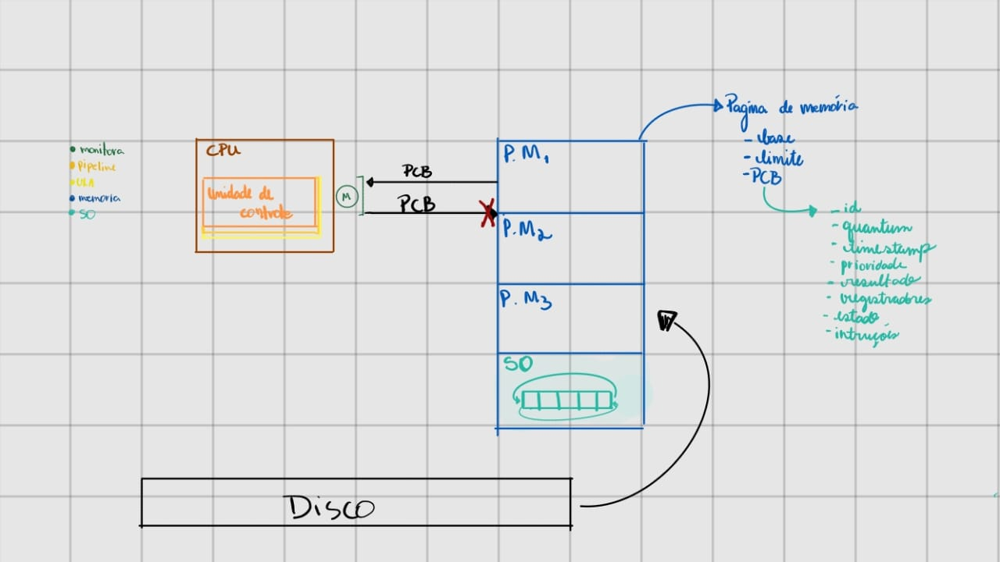
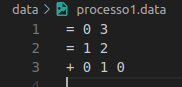
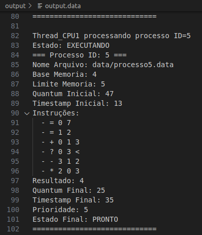

<h1 align="center" font-size="200em"><b>Simulador da Arquitetura de Von Neumann com Pipeline MIPS, Escalonamento FCFS e
Gerencia de Memória</b></h1>

<!-- imagem -->

## Abstração da CPU

Confira abaixo o diagrama que ilustra a abstração da CPU, em conjunto com o sistema operacional e a memória.

## Arquivos de entrada e saída

### Input 

**Observação:** Os arquivos de input devem obrigatoriamente estar no formato **.data**.  
É possível alterar essa configuração no código antes da execução. Certifique-se de armazená-los na pasta **data**.

### Output

O arquivo de saída sera armazenado na pasta **output**.

## 👾Compilação e execução

- Especificações da máquina em que o código foi rodado:
  - Processador Intel Core i7, 12th Gen;
  - Sistema Operacional Ubuntu 22.04.5;
  - 16GB de RAM.
- | Comando      | Função                                                                                  |
  | ------------ | --------------------------------------------------------------------------------------- |
  | `make clean` | Apaga a última compilação realizada contida na pasta build                              |
  | `make`       | Executa a compilação do programa utilizando o gcc, e o resultado vai para a pasta build |
  | `make run`   | Executa o programa da pasta build após a realização da compilação                       |

## Contato

  
 Letícia de Oliveira

 <a href="https://t.me/letolsilva">
  
 

<a style="color:black" href="mailto:letolsilva22@gmail.com?subject=[GitHub]%20Source%20Dynamic%20Lists">
✉️ <i>letolsilva22@gmail.com</i>
</a>

  
 Lucas Lima de Oliveira

 <a href="https://t.me/">
  
 

<a style="color:black" href="mailto:lucaslimadeoliveira80@gmail.com?subject=[GitHub]%20Source%20Dynamic%20Lists">
✉️ <i>lucaslimadeoliveira80@gmail.com</i>
</a>
